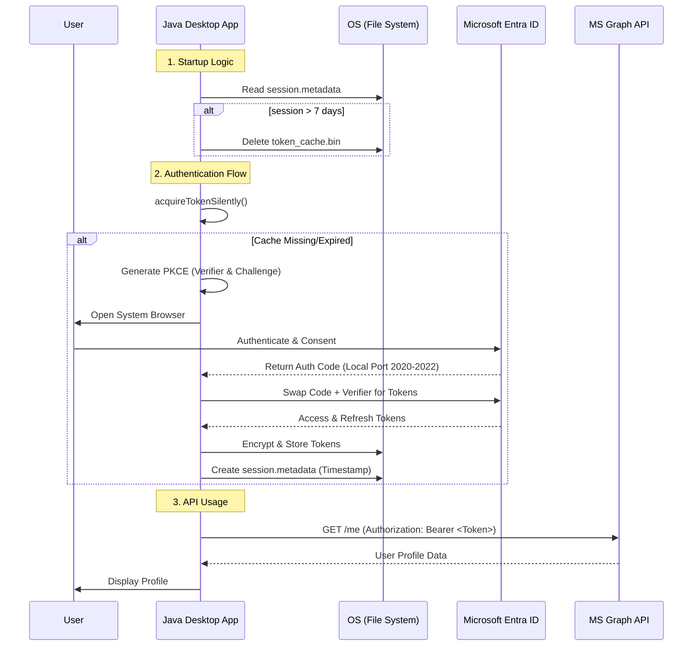

# 📄 Technical Specification: Java Desktop Client for Entra ID

## 1. Overview

This specification outlines the implementation of a secure Java desktop application that authenticates users against **Microsoft Entra ID** (formerly Azure AD) using the **OAuth 2.0 Authorization Code Flow with PKCE**.

### Key Security Pillars

* **PKCE (Proof Key for Code Exchange):** Eliminates the need for a client secret in public applications.
* **Persistent Secure Cache:** Encrypted storage of tokens using platform-native tools (Keyring/Keychain/DPAPI).
* **Session Lifecycle:** Hard enforcement of a 1-week session limit regardless of token expiration.
* **Dynamic Port Handling:** Resiliency against local port conflicts during the redirect phase.

---

## 2. Interaction Diagram

The following diagram illustrates the interaction between the Java App, the System Browser, and the Microsoft Entra ID services.

1. **Challenge Generation:** The Java app generates a `code_verifier` and its hashed `code_challenge`.
2. **Authorization Request:** App opens the browser with the `code_challenge`.
3. **User Authentication:** The user logs into Microsoft; Entra ID stores the challenge.
4. **Auth Code Delivery:** Entra ID redirects back to the app's local port with a temporary `code`.
5. **Token Exchange:** The app sends the `code` + original `code_verifier`. Entra ID verifies the hash and issues tokens.

---

## 3. Technical Implementation Details

### A. Authentication Logic

The application must prioritize **Silent Authentication**. The flow should be:

1. Check for local **Metadata** (see section B). If expired, clear cache.
2. Call `acquireTokenSilently`.
3. If successful, use the token.
4. If it fails (e.g., `MsalInteractionRequiredException`), initiate `acquireToken` (Interactive Flow).

### B. Session & Storage Management

The application manages two files in the user's home directory (`~/.my_secure_app/`):

* **`token_cache.bin`**: Encrypted binary file containing access/refresh tokens. Managed via `msal4j-persistence-extension`.
* **`session.metadata`**: A plain-text properties file tracking the initial login time.

**Enforcement Rule:**
Upon every startup, the app must read `session.metadata`. If `currentTime - firstLoginAt > 7 days`, both files must be deleted to force a fresh identity challenge.

### C. Network & Resiliency

To avoid "Address already in use" errors, the app must probe ports **2020, 2021, and 2022**. The chosen port must be passed as the `redirect_uri` to the `InteractiveRequestParameters`.

---

## 4. Error Handling Requirements

| Scenario | Detection | Action |
| --- | --- | --- |
| **Disabled Account** | Exception contains `AADSTS50057` | Block UI, show "Account Disabled" message. |
| **User Cancelled** | `ResolutionException` or Timeout | Return to "Sign In" home screen. |
| **Network Offline** | `MsalServiceException` (No host) | Prompt user to check internet connection. |

---

## 5. Development Setup

* **Language:** Java 11+
* **Core Libraries:** `msal4j`, `msal4j-persistence-extension`
* **Build Tool:** Maven (Assembly plugin for Runnable JAR)
* **Entra Configuration:**
* **Application Type:** Public Client (Mobile & Desktop)
* **Redirect URIs:** `http://localhost:2020`, `http://localhost:2021`, `http://localhost:2022`
* **API Permissions:** `User.Read` (Delegated)


## 1. Interaction Diagram 

The following sequence illustrates the **Authorization Code Flow with PKCE**, including our custom session validation logic.



---

## 2. Complete Java Implementation

This single-class application handles port-probing, PKCE, 7-day enforcement, and secure storage.

### Maven Dependencies

```xml
<dependencies>
    <dependency>
        <groupId>com.microsoft.azure</groupId>
        <artifactId>msal4j</artifactId>
        <version>1.17.0</version>
    </dependency>
    <dependency>
        <groupId>com.microsoft.azure</groupId>
        <artifactId>msal4j-persistence-extension</artifactId>
        <version>1.3.0</version>
    </dependency>
</dependencies>

```

### Full Source Code

```java
import com.microsoft.aad.msal4j.*;
import com.microsoft.aad.msal4jextensions.*;
import java.io.*;
import java.net.*;
import java.nio.file.*;
import java.time.Instant;
import java.time.temporal.ChronoUnit;
import java.util.*;
import java.util.concurrent.TimeUnit;

public class EntraClientApp {

    private final static String CLIENT_ID = "YOUR_CLIENT_ID";
    private final static String AUTHORITY = "https://login.microsoftonline.com/common/";
    private final static Set<String> SCOPES = Collections.singleton("User.Read");
    private final static int[] PORTS = {2020, 2021, 2022};

    public static void main(String[] args) throws Exception {
        Path appDir = Paths.get(System.getProperty("user.home"), ".my_secure_app");
        Files.createDirectories(appDir);
        Path cacheFile = appDir.resolve("token_cache.bin");
        Path metaFile = appDir.resolve("session.metadata");

        // 1. Enforce 1-week limit
        enforceSessionLimit(cacheFile, metaFile);

        // 2. Initialize Secure Persistence (DPAPI on Win, Keychain on Mac)
        PersistenceSettings settings = PersistenceSettings.builder("msal.cache", cacheFile)
                .setMacKeychain("MyJavaApp", "MSALCache")
                .setLinuxKeyring("default", "msal.cache", "MsalClientID", "MsalClientSecret", "MsalClientValue")
                .build();
        ITokenCacheAccessAspect persistenceAspect = new PersistenceTokenCacheAccessAspect(settings);

        PublicClientApplication app = PublicClientApplication.builder(CLIENT_ID)
                .authority(AUTHORITY)
                .setTokenCacheAccessAspect(persistenceAspect)
                .build();

        // 3. Authenticate and Handle Specific Exceptions
        try {
            IAuthenticationResult result = acquireToken(app);
            initializeMetadata(metaFile); 
            System.out.println("Success! Hello, " + result.account().username());
        } catch (MsalServiceException ex) {
            if (ex.getMessage().contains("AADSTS50057")) {
                System.err.println("CRITICAL: Account is disabled by Admin.");
            } else {
                System.err.println("Service Error: " + ex.errorCode());
            }
        } catch (Exception e) {
            System.err.println("Authentication failed: " + e.getMessage());
        }
    }

    private static IAuthenticationResult acquireToken(PublicClientApplication app) throws Exception {
        Set<IAccount> accounts = app.getAccounts().join();
        IAccount account = accounts.isEmpty() ? null : accounts.iterator().next();

        try {
            return app.acquireTokenSilently(SilentParameters.builder(SCOPES, account).build()).join();
        } catch (Exception e) {
            int port = findPort();
            InteractiveRequestParameters params = InteractiveRequestParameters.builder(new URI("http://localhost:" + port))
                    .scopes(SCOPES)
                    .httpPollingTimeoutInSeconds(120)
                    .build();
            return app.acquireToken(params).get(2, TimeUnit.MINUTES);
        }
    }

    private static int findPort() throws IOException {
        for (int port : PORTS) {
            try (ServerSocket s = new ServerSocket(port)) { return port; }
            catch (IOException ignored) {}
        }
        throw new IOException("All preferred ports are busy.");
    }

    private static void enforceSessionLimit(Path cache, Path meta) throws IOException {
        if (Files.exists(meta)) {
            Properties p = new Properties();
            try (InputStream in = Files.newInputStream(meta)) {
                p.load(in);
                Instant start = Instant.ofEpochMilli(Long.parseLong(p.getProperty("start")));
                if (start.isBefore(Instant.now().minus(7, ChronoUnit.DAYS))) {
                    Files.deleteIfExists(cache);
                    Files.deleteIfExists(meta);
                    System.out.println("Session limit (7 days) reached. Cache cleared.");
                }
            }
        }
    }

    private static void initializeMetadata(Path meta) throws IOException {
        if (!Files.exists(meta)) {
            Properties p = new Properties();
            p.setProperty("start", String.valueOf(Instant.now().toEpochMilli()));
            try (OutputStream out = Files.newOutputStream(meta)) {
                p.store(out, null);
            }
        }
    }
}

```

## Testing

To test the 7-day logic and the metadata enforcement without needing a live internet connection or a real Microsoft account, we use **JUnit 5** and **Mockito**.

The primary goal of these tests is to verify that the application correctly identifies an "expired" session and wipes the files, and that it correctly handles the "disabled account" error code.

### 📦 1. Add Test Dependencies

Add these to your `pom.xml`:

```xml
<dependency>
    <groupId>org.junit.jupiter</groupId>
    <artifactId>junit-jupiter-api</artifactId>
    <version>5.10.0</version>
    <scope>test</scope>
</dependency>
<dependency>
    <groupId>org.mockito</groupId>
    <artifactId>mockito-core</artifactId>
    <version>5.5.0</version>
    <scope>test</scope>
</dependency>

```

---

### 🧪 2. The Unit Test Suite

This test class focuses on the custom logic we built for file management and error parsing.

```java
import org.junit.jupiter.api.*;
import java.io.*;
import java.nio.file.*;
import java.time.Instant;
import java.time.temporal.ChronoUnit;
import java.util.Properties;
import static org.junit.jupiter.api.Assertions.*;

class EntraClientAppTest {

    private Path tempDir;
    private Path cacheFile;
    private Path metaFile;

    @BeforeEach
    void setUp() throws IOException {
        // Create a temporary directory for each test to avoid side effects
        tempDir = Files.createTempDirectory("entra_test");
        cacheFile = tempDir.resolve("token_cache.bin");
        metaFile = tempDir.resolve("session.metadata");
    }

    @Test
    @DisplayName("Should delete cache if metadata is older than 7 days")
    void testSessionEnforcementExpired() throws IOException {
        // Create a dummy cache file
        Files.writeString(cacheFile, "dummy-token-data");

        // Create metadata from 8 days ago
        Properties p = new Properties();
        Instant eightDaysAgo = Instant.now().minus(8, ChronoUnit.DAYS);
        p.setProperty("start", String.valueOf(eightDaysAgo.toEpochMilli()));
        
        try (OutputStream out = Files.newOutputStream(metaFile)) {
            p.store(out, null);
        }

        // Run enforcement logic
        EntraClientApp.enforceSessionLimit(cacheFile, metaFile);

        // Assert files were deleted
        assertFalse(Files.exists(cacheFile), "Cache file should have been deleted");
        assertFalse(Files.exists(metaFile), "Metadata file should have been deleted");
    }

    @Test
    @DisplayName("Should keep cache if metadata is only 1 day old")
    void testSessionEnforcementValid() throws IOException {
        Files.writeString(cacheFile, "valid-token-data");

        Properties p = new Properties();
        Instant yesterday = Instant.now().minus(1, ChronoUnit.DAYS);
        p.setProperty("start", String.valueOf(yesterday.toEpochMilli()));
        
        try (OutputStream out = Files.newOutputStream(metaFile)) {
            p.store(out, null);
        }

        EntraClientApp.enforceSessionLimit(cacheFile, metaFile);

        assertTrue(Files.exists(cacheFile), "Cache file should still exist");
    }

    @Test
    @DisplayName("Should correctly identify AADSTS50057 (Disabled Account) error string")
    void testDisabledAccountErrorParsing() {
        String mockErrorMessage = "AADSTS50057: The user account is disabled. Trace ID: ...";
        
        // Simulating the catch logic in our main app
        boolean isDisabled = mockErrorMessage.contains("AADSTS50057");
        
        assertTrue(isDisabled, "Logic should detect the disabled account error code");
    }

    @AfterEach
    void tearDown() throws IOException {
        // Clean up temporary files
        Files.deleteIfExists(metaFile);
        Files.deleteIfExists(cacheFile);
        Files.deleteIfExists(tempDir);
    }
}

```

---

### 🛡️ 3. Testing the "Disabled Account" Flow

Since `MsalServiceException` is a library class, we usually mock the exception itself to test how our UI responds.

```java
@Test
void testMsalServiceExceptionHandling() {
    // We mock the exception to return the specific Microsoft error code for disabled accounts
    MsalServiceException mockException = org.mockito.Mockito.mock(MsalServiceException.class);
    org.mockito.Mockito.when(mockException.getMessage()).thenReturn("AADSTS50057: User account is disabled.");

    // Verify our logic catches it
    boolean handledCorrectly = false;
    if (mockException.getMessage().contains("AADSTS50057")) {
        handledCorrectly = true;
    }

    assertTrue(handledCorrectly);
}

```

### 💡 Why these tests matter

1. **Regression:** If someone accidentally changes the "7" to "70" in the code, the first test will fail immediately.
2. **Edge Cases:** You can test what happens if the metadata file is corrupted or empty without having to wait 7 days in real life.
3. **Speed:** You can verify your logic in milliseconds rather than manually clicking through a browser login.

